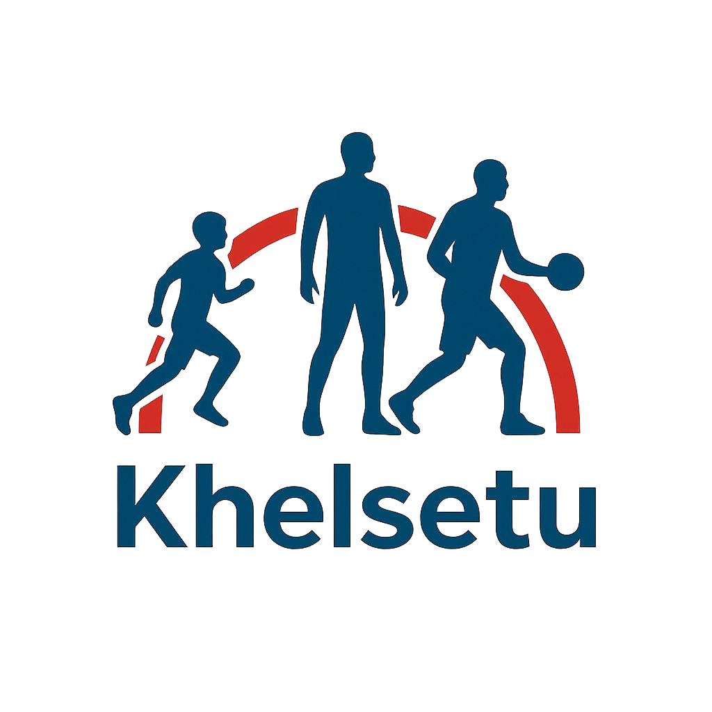

# 🏃‍♂️ Khelsetu - Athlete Performance Testing App

A comprehensive mobile application for athlete performance testing, posture analysis, and AI-powered coaching assistance. Built with React, TypeScript, and Capacitor for cross-platform deployment.



## 📋 Table of Contents

- [Features](#-features)
- [Tech Stack](#-tech-stack)
- [Prerequisites](#-prerequisites)
- [Installation](#-installation)
- [Running the Project](#-running-the-project)
- [Building for Production](#-building-for-production)
- [Mobile App Development](#-mobile-app-development)
- [ML Integration](#-ml-integration)
- [Project Structure](#-project-structure)
- [Environment Setup](#-environment-setup)
- [Troubleshooting](#-troubleshooting)
- [Contributing](#-contributing)

## ✨ Features

- 🎯 **Real-time Human Detection** - AI-powered pose detection and analysis
- 📱 **Cross-platform Mobile App** - Native Android/iOS support via Capacitor
- 🏋️‍♂️ **Exercise Classification** - Smart exercise recognition and coaching
- 📊 **Performance Analytics** - Comprehensive athlete performance tracking
- 🌐 **Multi-language Support** - i18n support with voice feedback
- 🎮 **Gamification** - Engaging athlete progression system
- 👥 **Social Features** - Community interaction and competition
- 🔐 **Secure Authentication** - Supabase-powered user management
- 📹 **Video Analysis** - Advanced biomechanical assessment
- 🤖 **AI Coach Assistant** - Intelligent coaching recommendations

## 🛠 Tech Stack

### Frontend
- **React 18.3.1** - Modern UI library
- **TypeScript** - Type-safe development
- **Vite** - Fast build tool and dev server
- **Tailwind CSS** - Utility-first styling
- **Radix UI** - Accessible component primitives
- **React Router DOM** - Client-side routing
- **React Hook Form** - Form state management

### Mobile Development
- **Capacitor 7.4.3** - Native mobile app framework
- **Ionic React** - Mobile-optimized UI components
- **Cordova Plugins** - Device API access

### AI/ML Integration
- **TensorFlow.js** - Client-side machine learning
- **Python ML Models** - Advanced pose detection
- **COCO-SSD** - Object detection model
- **Pose Detection** - Human pose estimation

### Backend & Services
- **Supabase** - Backend as a Service
- **Flask API** - Python ML model server
- **Real-time Database** - Live data synchronization

## 📋 Prerequisites

Before running this project, ensure you have:

- **Node.js** (v18 or higher) - [Download here](https://nodejs.org/)
- **npm** or **yarn** package manager
- **Git** - Version control
- **Android Studio** (for Android development) - [Download here](https://developer.android.com/studio)
- **Xcode** (for iOS development, macOS only)
- **Python 3.8+** (for ML models) - [Download here](https://python.org/)

## 📥 Installation

### 1. Clone the Repository

```bash
git clone https://github.com/aka75035/KhelSetu-GoChamp.git
cd KhelSetu-GoChamp
```

### 2. Install Dependencies

```bash
# Install Node.js dependencies
npm install

# Install Python dependencies (for ML models)
cd ml_models
pip install -r requirements.txt
cd ..
```

### 3. Environment Configuration

Create a `.env` file in the root directory:

```env
# Supabase Configuration
VITE_SUPABASE_URL=your_supabase_url
VITE_SUPABASE_ANON_KEY=your_supabase_anon_key

# ML Server Configuration
VITE_ML_SERVER_URL=http://localhost:5000

# App Configuration
VITE_APP_NAME=Khelsetu
VITE_APP_VERSION=0.1.0
```

## 🚀 Running the Project

### Development Mode (Web)

```bash
# Start the development server
npm run dev

# The app will be available at http://localhost:5173
```

### With ML Models (Full Features)

1. **Start the Python ML Server:**

```bash
# Option 1: Using start script
cd ml_models
python start_server.py

# Option 2: Using batch file (Windows)
cd ml_models
start_server.bat

# Option 3: Manual start
cd ml_models/python
python api_server.py
```

2. **Start the React App:**

```bash
# In a new terminal
npm run dev
```

### Production Preview

```bash
# Build the project
npm run build

# Preview the production build
npm run preview
```

## 🏗 Building for Production

### Web Build

```bash
npm run build
```

The built files will be in the `dist/` directory.

### Mobile App Build

#### Android

1. **Build the web app:**
```bash
npm run build
```

2. **Sync with Capacitor:**
```bash
npx cap sync android
```

3. **Open in Android Studio:**
```bash
npx cap open android
```

4. **Build APK in Android Studio:**
   - Build → Build Bundle(s) / APK(s) → Build APK(s)
   - Or run: `./gradlew assembleDebug` in the `android/` directory

#### iOS (macOS only)

1. **Build the web app:**
```bash
npm run build
```

2. **Sync with Capacitor:**
```bash
npx cap sync ios
```

3. **Open in Xcode:**
```bash
npx cap open ios
```

## 📱 Mobile App Development

### Adding Capacitor Platforms

```bash
# Add Android platform
npx cap add android

# Add iOS platform
npx cap add ios
```

### Capacitor Commands

```bash
# Sync web app with native platforms
npx cap sync

# Copy web assets to native platforms
npx cap copy

# Update Capacitor and plugins
npx cap update

# Run on device/emulator
npx cap run android
npx cap run ios
```

### Live Reload (Development)

```bash
# Start dev server with specific host
npm run dev -- --host

# Then sync with live reload
npx cap run android -l --external
npx cap run ios -l --external
```

## 🤖 ML Integration

The app includes both client-side and server-side ML capabilities:

### Client-side ML (TensorFlow.js)
- Real-time pose detection
- Lightweight object detection
- Browser-based inference

### Server-side ML (Python)
- Advanced human detection models
- Exercise classification
- Performance analysis algorithms

See [ML_INTEGRATION_GUIDE.md](./ML_INTEGRATION_GUIDE.md) for detailed setup instructions.

## 📁 Project Structure

```
khelsetuapp/
├── 📱 android/                    # Android native code
├── 🎬 Assets/                     # Media assets (videos, images)
├── 📊 ml_models/                  # Python ML models and API
│   ├── python/                    # ML model implementations
│   ├── inference/                 # TypeScript ML integration
│   └── requirements.txt           # Python dependencies
├── 🌐 public/                     # Static assets
├── 📝 src/                        # Source code
│   ├── components/                # React components
│   │   ├── ui/                    # Reusable UI components
│   │   └── figma/                 # Figma-exported components
│   ├── hooks/                     # Custom React hooks
│   ├── i18n/                      # Internationalization
│   ├── lib/                       # Utility libraries
│   ├── screens/                   # Main app screens
│   │   ├── admin/                 # Admin interface
│   │   └── athlete/               # Athlete interface
│   ├── styles/                    # CSS styles
│   └── utils/                     # Helper functions
├── 📋 capacitor.config.json       # Capacitor configuration
├── 📦 package.json               # Dependencies and scripts
├── ⚡ vite.config.ts             # Vite configuration
└── 📖 README.md                  # This file
```

## 🔧 Environment Setup

### Supabase Setup

1. Create a new project at [supabase.com](https://supabase.com)
2. Copy your project URL and anon key to `.env`
3. Run database migrations (if any) in the Supabase dashboard

### Android Development Setup

1. **Install Android Studio**
2. **Install Android SDK** (API level 33 or higher)
3. **Set up environment variables:**
   ```bash
   # Add to your shell profile (.bashrc, .zshrc, etc.)
   export ANDROID_HOME=$HOME/Android/Sdk
   export PATH=$PATH:$ANDROID_HOME/emulator
   export PATH=$PATH:$ANDROID_HOME/tools
   export PATH=$PATH:$ANDROID_HOME/tools/bin
   export PATH=$PATH:$ANDROID_HOME/platform-tools
   ```

### iOS Development Setup (macOS only)

1. **Install Xcode** from the App Store
2. **Install Xcode Command Line Tools:**
   ```bash
   xcode-select --install
   ```
3. **Install CocoaPods:**
   ```bash
   sudo gem install cocoapods
   ```

## 🐛 Troubleshooting

### Common Issues

#### White Screen on Mobile
- **Cause:** Asset path issues or missing dependencies
- **Solution:** Check console errors via `chrome://inspect` and ensure relative asset paths

#### Module Resolution Errors
- **Cause:** Incompatible Cordova plugins
- **Solution:** Use Capacitor-native alternatives

#### Build Failures
- **Cause:** Outdated dependencies or conflicting versions
- **Solution:** Clear node_modules and reinstall:
  ```bash
  rm -rf node_modules package-lock.json
  npm install
  ```

#### Camera Permissions
- **Cause:** Missing platform-specific permissions
- **Solution:** Check `capacitor.config.json` and native permission settings

### Debug Commands

```bash
# Check Capacitor doctor
npx cap doctor

# View device logs
npx cap run android --log
npx cap run ios --log

# Inspect web views (Android)
# Open chrome://inspect in Chrome
```

## 🚀 Deployment

### Web Deployment

The app can be deployed to any static hosting service:

- **Vercel:** `vercel --prod`
- **Netlify:** Drag and drop `dist/` folder
- **GitHub Pages:** Use GitHub Actions workflow

### App Store Deployment

#### Google Play Store
1. Build release APK in Android Studio
2. Sign with release keystore
3. Upload to Google Play Console

#### Apple App Store
1. Build archive in Xcode
2. Upload to App Store Connect
3. Submit for review

## 🤝 Contributing

1. Fork the repository
2. Create a feature branch: `git checkout -b feature/amazing-feature`
3. Commit your changes: `git commit -m 'Add amazing feature'`
4. Push to the branch: `git push origin feature/amazing-feature`
5. Open a Pull Request

### Development Guidelines

- Follow TypeScript best practices
- Use conventional commit messages
- Add tests for new features
- Update documentation as needed

## 📄 License

This project is licensed under the MIT License - see the [LICENSE](LICENSE) file for details.

## 🔗 Links

- **Original Design:** [Figma](https://www.figma.com/design/svb5hyzbaHgstP6tFazZyG/Athlete-Performance-Testing-App)
- **Supabase:** [Dashboard](https://supabase.com)
- **Capacitor Docs:** [Documentation](https://capacitorjs.com/docs)

## 👥 Team

Built with ❤️ for the Smart India Hackathon 2024

---

**Happy Coding! 🚀**
  